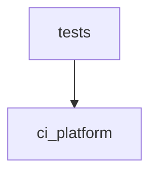

# Code Graph Review — ci-platform

**Generated by:** code_graph_review.py
**Root:** C:\Users\baner\CopyFolder\IoT_thoughts\python-projects\kaggle_experiments\claude_projects\ci-platform

## Summary

| Metric | Value |
|--------|-------|
| Total modules | 42 |
| Source modules | 23 |
| Test modules | 19 |
| Total lines | 6,505 |
| Source lines | 3,903 |
| Test lines | 2,602 |
| Classes | 39 |
| Top-level functions | 159 |
| External dependencies | 30 |
| Circular dependencies | 0 |
| Dead export candidates | 38 |

## Module Inventory

| Module | Lines | Classes | Functions | Internal Imports | External |
|--------|-------|---------|-----------|-----------------|----------|
| ci_platform\__init__.py | 1 | 0 | 0 | 0 | 0 |
| ci_platform\audit\__init__.py | 0 | 0 | 0 | 0 | 0 |
| ci_platform\audit\evidence_ledger.py | 245 | 3 | 0 | 0 | 6 |
| ci_platform\auth\__init__.py | 1 | 0 | 0 | 0 | 0 |
| ci_platform\auth\saml.py | 281 | 2 | 2 | 0 | 8 |
| ci_platform\connectors\__init__.py | 1 | 0 | 0 | 0 | 0 |
| ci_platform\connectors\base.py | 11 | 1 | 0 | 0 | 3 |
| ci_platform\connectors\sentinel.py | 192 | 2 | 0 | 1 | 5 |
| ci_platform\connectors\sentinel_writeback.py | 168 | 3 | 0 | 1 | 4 |
| ci_platform\connectors\splunk.py | 157 | 2 | 0 | 1 | 5 |
| ci_platform\enrichment\__init__.py | 0 | 0 | 0 | 0 | 0 |
| ci_platform\enrichment\enrichment_advisor.py | 133 | 3 | 0 | 0 | 3 |
| ci_platform\entity_resolution\__init__.py | 1 | 0 | 0 | 0 | 0 |
| ci_platform\entity_resolution\resolver.py | 228 | 4 | 0 | 0 | 5 |
| ci_platform\graph\__init__.py | 11 | 0 | 0 | 1 | 0 |
| ci_platform\graph\age_client.py | 899 | 1 | 2 | 0 | 12 |
| ci_platform\onboarding\__init__.py | 1 | 0 | 0 | 0 | 0 |
| ci_platform\onboarding\centroid_convergence.py | 116 | 0 | 2 | 0 | 3 |
| ci_platform\onboarding\deployment_qualification.py | 486 | 5 | 2 | 1 | 4 |
| ci_platform\onboarding\pipeline.py | 542 | 4 | 2 | 6 | 5 |
| ci_platform\redaction\__init__.py | 1 | 0 | 0 | 0 | 0 |
| ci_platform\redaction\pii_redactor.py | 197 | 4 | 3 | 0 | 6 |
| prompt0_ci_structural_map.py | 231 | 0 | 0 | 0 | 2 |
| tests\__init__.py (test) | 1 | 0 | 0 | 0 | 0 |
| tests\integration\__init__.py (test) | 0 | 0 | 0 | 0 | 0 |
| tests\integration\test_p28_end_to_end.py (test) | 162 | 0 | 4 | 1 | 2 |
| tests\test_age_client.py (test) | 345 | 0 | 22 | 2 | 7 |
| tests\test_age_cypher_compat.py (test) | 81 | 2 | 0 | 1 | 3 |
| tests\test_age_type_roundtrip.py (test) | 145 | 3 | 0 | 1 | 3 |
| tests\test_centroid_distance.py (test) | 54 | 0 | 5 | 2 | 2 |
| tests\test_deployment_qualification.py (test) | 241 | 0 | 23 | 1 | 2 |
| tests\test_entity_resolution.py (test) | 112 | 0 | 10 | 1 | 0 |
| tests\test_evidence_ledger.py (test) | 325 | 0 | 22 | 1 | 1 |
| tests\test_evidence_ledger_concurrency.py (test) | 96 | 0 | 5 | 1 | 1 |
| tests\test_graph_backend_switcher.py (test) | 128 | 0 | 6 | 1 | 3 |
| tests\test_onboarding_pipeline.py (test) | 212 | 0 | 8 | 3 | 4 |
| tests\test_p28_enrichment_advisor.py (test) | 65 | 0 | 4 | 1 | 1 |
| tests\test_pii_redactor.py (test) | 82 | 0 | 10 | 1 | 2 |
| tests\test_saml.py (test) | 108 | 0 | 11 | 1 | 1 |
| tests\test_sentinel.py (test) | 166 | 0 | 6 | 1 | 3 |
| tests\test_sentinel_writeback.py (test) | 153 | 0 | 5 | 1 | 2 |
| tests\test_splunk.py (test) | 126 | 0 | 5 | 1 | 3 |

## Class & Function Index

### ci_platform\audit\evidence_ledger.py
- **class** `LedgerEntry` (line 28)
- **class** `OutcomeEntry` (line 81)
- **class** `EvidenceLedger` (line 116)

### ci_platform\auth\saml.py
- **class** `SAMLConfig` (line 13)
- **class** `SAMLService` (line 38)
- **def** `_find_text` (line 268)
- **def** `_find_attr` (line 276)

### ci_platform\connectors\base.py
- **class** `SourceConnectorProtocol` (line 5)

### ci_platform\connectors\sentinel.py
- **class** `SentinelConfig` (line 37)
- **class** `SentinelConnector` (line 48)

### ci_platform\connectors\sentinel_writeback.py
- **class** `EnrichmentType` (line 9)
- **class** `EnrichmentPayload` (line 16)
- **class** `SentinelWriteBack` (line 23)

### ci_platform\connectors\splunk.py
- **class** `SplunkConfig` (line 22)
- **class** `SplunkConnector` (line 34)

### ci_platform\enrichment\enrichment_advisor.py
- **class** `FactorOpportunity` (line 54)
- **class** `EnrichmentReport` (line 63)
- **class** `EnrichmentAdvisor` (line 71)

### ci_platform\entity_resolution\resolver.py
- **class** `IdentifierType` (line 8)
- **class** `Identifier` (line 34)
- **class** `ResolvedEntity` (line 42)
- **class** `EntityResolver` (line 51)

### ci_platform\graph\age_client.py
- **class** `AGEClient` (line 72)
- **def** `_check_safe_cypher` (line 53)
- **def** `get_graph_client` (line 880)

### ci_platform\onboarding\centroid_convergence.py
- **def** `compute_centroid_distance` (line 26)
- **def** `interpret_distance_trend` (line 39)

### ci_platform\onboarding\deployment_qualification.py
- **class** `NoiseProfile` (line 90)
- **class** `TauCalibration` (line 98)
- **class** `RemediationItem` (line 106)
- **class** `QualificationResult` (line 198)
- **class** `DeploymentQualifier` (line 214)
- **def** `_compute_ece` (line 116)
- **def** `sweep_tau_for_deployment` (line 149)

### ci_platform\onboarding\pipeline.py
- **class** `StageResult` (line 52)
- **class** `LoadManifest` (line 62)
- **class** `PipelineResult` (line 70)
- **class** `OnboardingPipeline` (line 83)
- **def** `_infer_user_id_type` (line 522)
- **def** `_failed_result` (line 532)

### ci_platform\redaction\pii_redactor.py
- **class** `RedactionStrategy` (line 8)
- **class** `RedactionResult` (line 15)
- **class** `RedactionReport` (line 23)
- **class** `PIIRedactor` (line 29)
- **def** `_deduplicate` (line 164)
- **def** `_merge_reports` (line 182)
- **def** `_get_spacy_model` (line 192)

## Dependency Graph

## Coupling Metrics

| Directory | Efferent (Ce) | Afferent (Ca) | Instability |
|-----------|--------------|--------------|-------------|
| ci_platform | 11 | 21 | 0.344 |
| root | 0 | 0 | 0.0 |
| tests | 21 | 0 | 1.0 |

## Circular Dependencies

None detected.

## Dead Export Candidates

(Public names defined but never imported internally)

- `EvidenceLedger` at ci_platform\audit\evidence_ledger.py:116
- `LedgerEntry` at ci_platform\audit\evidence_ledger.py:28
- `OutcomeEntry` at ci_platform\audit\evidence_ledger.py:81
- `SAMLConfig` at ci_platform\auth\saml.py:13
- `SAMLService` at ci_platform\auth\saml.py:38
- `SourceConnectorProtocol` at ci_platform\connectors\base.py:5
- `SentinelConfig` at ci_platform\connectors\sentinel.py:37
- `SentinelConnector` at ci_platform\connectors\sentinel.py:48
- `EnrichmentPayload` at ci_platform\connectors\sentinel_writeback.py:16
- `EnrichmentType` at ci_platform\connectors\sentinel_writeback.py:9
- `SentinelWriteBack` at ci_platform\connectors\sentinel_writeback.py:23
- `SplunkConfig` at ci_platform\connectors\splunk.py:22
- `SplunkConnector` at ci_platform\connectors\splunk.py:34
- `EnrichmentAdvisor` at ci_platform\enrichment\enrichment_advisor.py:71
- `EnrichmentReport` at ci_platform\enrichment\enrichment_advisor.py:63
- `FactorOpportunity` at ci_platform\enrichment\enrichment_advisor.py:54
- `EntityResolver` at ci_platform\entity_resolution\resolver.py:51
- `Identifier` at ci_platform\entity_resolution\resolver.py:34
- `IdentifierType` at ci_platform\entity_resolution\resolver.py:8
- `ResolvedEntity` at ci_platform\entity_resolution\resolver.py:42
- `AGEClient` at ci_platform\graph\age_client.py:72
- `get_graph_client` at ci_platform\graph\age_client.py:880
- `compute_centroid_distance` at ci_platform\onboarding\centroid_convergence.py:26
- `interpret_distance_trend` at ci_platform\onboarding\centroid_convergence.py:39
- `DeploymentQualifier` at ci_platform\onboarding\deployment_qualification.py:214
- `NoiseProfile` at ci_platform\onboarding\deployment_qualification.py:90
- `QualificationResult` at ci_platform\onboarding\deployment_qualification.py:198
- `RemediationItem` at ci_platform\onboarding\deployment_qualification.py:106
- `TauCalibration` at ci_platform\onboarding\deployment_qualification.py:98
- `sweep_tau_for_deployment` at ci_platform\onboarding\deployment_qualification.py:149
- `LoadManifest` at ci_platform\onboarding\pipeline.py:62
- `OnboardingPipeline` at ci_platform\onboarding\pipeline.py:83
- `PipelineResult` at ci_platform\onboarding\pipeline.py:70
- `StageResult` at ci_platform\onboarding\pipeline.py:52
- `PIIRedactor` at ci_platform\redaction\pii_redactor.py:29
- `RedactionReport` at ci_platform\redaction\pii_redactor.py:23
- `RedactionResult` at ci_platform\redaction\pii_redactor.py:15
- `RedactionStrategy` at ci_platform\redaction\pii_redactor.py:8

## External Dependencies

- __future__
- abc
- asyncio
- base64
- concurrent
- dataclasses
- datetime
- enum
- hashlib
- httpx
- inspect
- json
- logging
- math
- numpy
- onelogin
- os
- psycopg
- pytest
- random
- re
- spacy
- sqlite3
- threading
- time
- typing
- unittest
- urllib
- uuid
- xml
